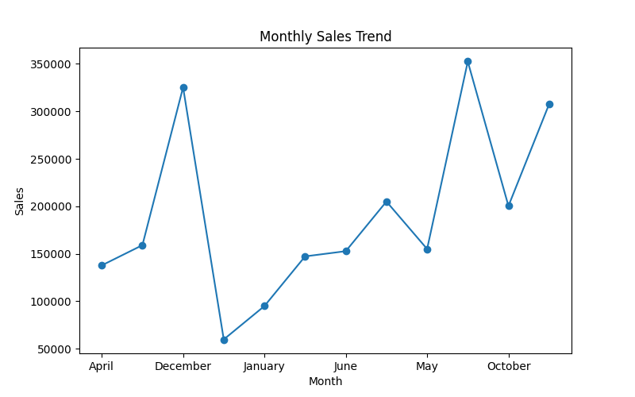
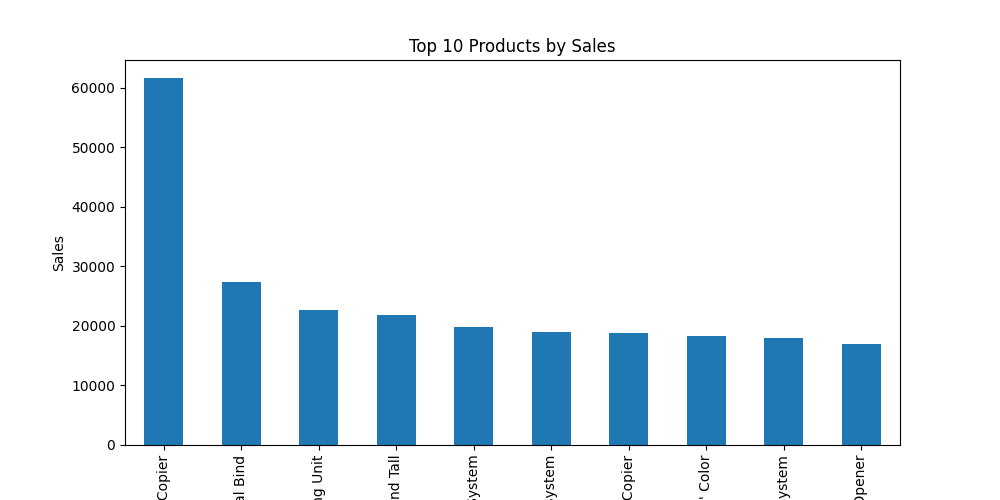
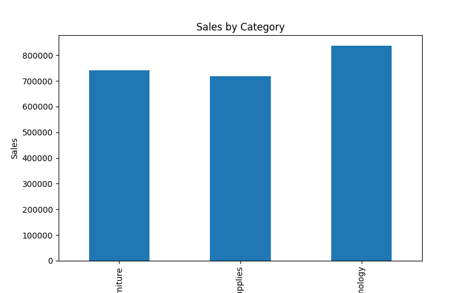
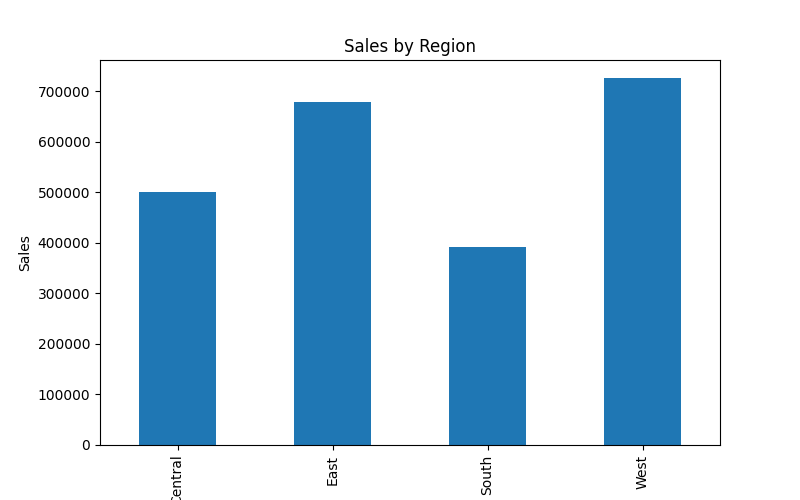
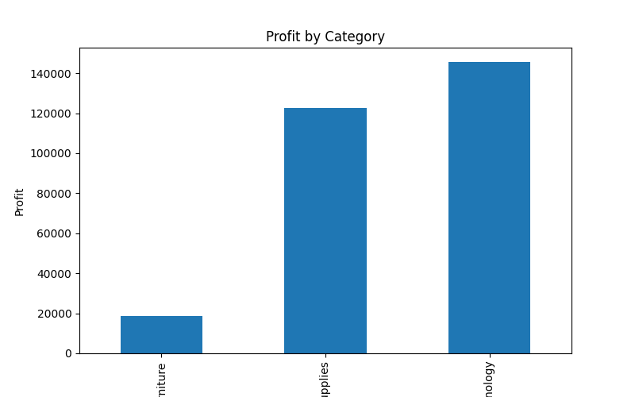

# 📊 Sales Data Analysis Project

## 🔍 Overview
This project focuses on analyzing a retail sales dataset to uncover meaningful business insights using Python. The analysis includes identifying sales trends, top-performing products, regional performance, and profit distribution.

---

## 🛠 Tools & Technologies Used
- Python
- Pandas
- Matplotlib

---

## 📁 Dataset
- Sample Superstore Dataset
- Contains information about:
  - Orders
  - Sales
  - Profit
  - Products
  - Regions
  - Customers

---

## 📈 Analysis Performed

### 1. Monthly Sales Trend
- Extracted month from order date
- Analyzed total sales per month
- Identified seasonal trends

### 2. Top 10 Products by Sales
- Grouped data by product name
- Identified highest revenue-generating products

### 3. Category-wise Sales
- Compared sales across product categories
- Identified top-performing category

### 4. Region-wise Sales
- Analyzed which region contributes most to sales

### 5. Profit Analysis
- Compared profit across categories
- Identified differences between sales and profit

---

## 📊 Visualizations

### Monthly Sales Trend

### Top 10 Products by Sales

### Category-wise Sales

### Region-wise Sales

### Profit Analysis

---

## 🔍 Key Insights
- Sales peak during the end-of-year months (October–December)
- Technology category generates the highest revenue
- Clear seasonal patterns observed in monthly sales
- Some categories have high sales but relatively lower profit
- Regional performance varies significantly

---

## 🚀 Conclusion
This project demonstrates how data analysis and visualization techniques can be used to extract meaningful insights from raw data. It highlights the importance of data-driven decision-making in business.

---

## 👨‍💻 Author
Arun Kumar
